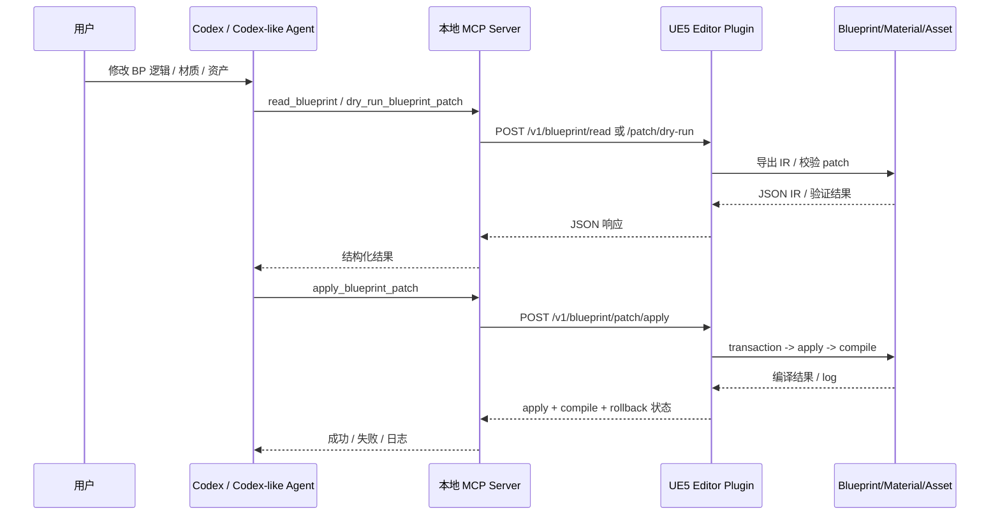

# UE5 蓝图 Agent 工作流完整参考实现

## 执行摘要

这项需求的核心，不是“让 LLM 学会猜蓝图”，而是把 **Blueprint/Material/Asset 的真实编辑能力** 从 Unreal Editor 暴露成一个可验证、可回滚、可编译的工具链。基于官方 Codex/MCP 文档、Epic 的编辑器 API、以及已有开源 Unreal MCP/蓝图编辑插件实践，最稳妥的落地方式是：**本地 stdio MCP server + UE5 Editor-only C++ 插件 + 本地只监听 `127.0.0.1` 的桥接层 + JSON IR + Patch DSL + dry-run/apply/compile/rollback 流程**。Codex 官方支持在 `~/.codex/config.toml` 或项目级 `.codex/config.toml` 注册本地 MCP server；MCP 官方也明确把 `stdio` 作为本地、由 client 拉起的标准传输方式；而 Unreal 官方 API 则提供了足够的构件来创建函数图、成员变量、节点、pin 连接、材质表达式、资产创建与保存。


需要坦诚说明的是：这个仓库是在当前环境中**完成了代码生成与结构设计**，但没有在真实 UE 5.1/5.2/5.3/5.4/5.5 项目上逐一执行编译验证。因此，它应被视为**高可信的运行骨架**，而不是已经在你目标小版本上完全验证过的发行版。尤其是 Unreal 的某些 Editor API 在 5.1+ 不同小版本可能存在轻微签名差异，而 Epic 官方还明确提示 Blueprint API 参考本身是“早期进行中，部分信息可能缺失或过时”，因此实现上必须依赖**运行时反射与编辑器内真实对象**，而不能只靠文档名称匹配。

## 证据基础与设计结论

从 Codex 侧看，官方已经给出了把 MCP server 接到 Codex 的一整套配置模型：`config.toml` 中的 `[mcp_servers.<id>]` 支持 `command`、`args`、`cwd`、`env`、`enabled_tools`、`disabled_tools`、`startup_timeout_sec`、`tool_timeout_sec` 等键；项目级 `.codex/config.toml` 也会在受信任项目中生效。Codex 还支持 `AGENTS.md` 分层加载项目指令，以及 Skills 目录下以 `SKILL.md` 为核心的技能封装，这正好适合把“先 read、再 dry-run、再 apply、最后 compile”的编辑工作流固化成 agent 的默认行为。

从 MCP 侧看，官方文档把 server 能力分为 **tools / resources / prompts**，并明确指出本地集成场景通常使用 `stdio`；工具本身是由模型自动发现、根据 schema 调用的。这意味着最适合 UE 编辑器的做法，不是把 `.uasset` 暴露成文件让 agent 乱写，而是把 “读蓝图 IR”“列出 BlueprintCallable 函数”“校验 patch”“应用 patch”“编译并回传日志” 都做成**结构化 MCP tools**。这样，agent 真正理解的是**图结构与编辑结果**，而不是二进制资产。

从 Unreal Editor 侧看，官方 API 已经覆盖了这个工作流的关键节点。`FBlueprintEditorUtils` 能添加函数图、成员变量并标记蓝图发生结构修改；`FKismetEditorUtilities` 能触发 Blueprint 编译；`UK2Node_CallFunction` 负责把某个 `UFunction` 映射成真实调用节点；`UEdGraphSchema_K2` 则提供 pin 连接与默认值设置；`FGraphNodeCreator` 负责正确构造图节点。材质侧，`UMaterialEditingLibrary` 提供创建表达式、连接表达式、连接材质属性、重编译材质以及设置材质实例参数的方法。资产侧，`FAssetToolsModule`、`UEditorAssetLibrary` 提供创建、加载、复制、重命名、保存资产的基础能力。

从架构可行性看，Epic 官方已经有两条相关证据链：一是 `HttpServer` 模块本身存在，二是 Remote Control 系统就是通过编辑器内 web server 接收 HTTP/WebSocket 请求来远程控制 Unreal。官方文档还特别说明绑定 `127.0.0.1` 时只允许本机访问。这使得“**UE 插件内部启动 localhost bridge，被本地 MCP server 调用**”成为一个合理、简洁、可审计的方案。它比直接把 UE Python 暴露给 agent 更利于控制权限边界，也比让 agent 直接操作二进制 `.uasset` 更安全。

开源项目也证明了这个方向是现实可行的。`ElgKismetEditorWidget` 已经展示了一个 editor-only 插件如何在 Blueprint Editor 中暴露图编译事件、节点选择事件，以及变量/函数/Macro/Event Dispatcher 的编辑能力；`flopperam/unreal-engine-mcp` 公开版展示了“读 Blueprint 内容、加节点、连节点、创建变量”的基础工具集；`ChiR24/Unreal_mcp` 则展示了“TypeScript MCP bridge + C++ automation bridge + 命令安全策略”的整体打法。因此，本报告中的实现不是拍脑袋构想，而是建立在**官方 API 的可执行边界**和**已有社区实践**这两条证据上的综合收敛。

## 完整实现总览

这套实现的最小闭环是：**Codex 通过 MCP 调用本地 `server.js`，`server.js` 把 YAML Patch 解析成 JSON 并转发给 UE 插件的本地 HTTP bridge，插件在 game thread 上执行 Blueprint/Material/Asset 编辑，然后 compile，并把日志返回给 MCP client。** 这个闭环与 Codex 官方的本地 MCP 配置方式、MCP 的 stdio transport 模型，以及 Unreal Editor 的 editor-only 模块化方式是完全对齐的。



下面这个功能矩阵对应你要求的重点能力。其中“官方依据”一列是设计所依赖的 API 面；“本实现状态”则是 ZIP 中已给出的参考落地。官方文档支持 Blueprint 图、材质图、资产和插件/模块组织方式；开源项目则证明这一类 agent-bridge 工作流已经有现实先例。

| 能力 | 官方依据 | 本实现状态 |
|---|---|---|
| Codex 本地 MCP 集成 | `config.toml` 的 `[mcp_servers.*]`、stdio MCP | 已给出 `.codex/config.toml` 与 `mcp-server/server.js` |
| Blueprint JSON IR 导出 | `UEdGraph` / `UEdGraphPin` / `FBlueprintEditorUtils` | 已实现 |
| Patch DSL dry-run | MCP tool schema + 插件内验证器 | 已实现 |
| Blueprint 变量/函数创建 | `AddMemberVariable` / `AddFunctionGraph` | 已实现 |
| 节点创建与 pin 连接 | `FGraphNodeCreator` / `UK2Node_*` / `TryCreateConnection` | 已实现基础节点 |
| 编译并回传日志 | `CompileBlueprint` + 输出捕获 | 已实现 |
| 材质表达式创建/连接 | `UMaterialEditingLibrary` | 已实现基础操作 |
| 资产创建/复制/属性设置 | `FAssetToolsModule` / `UEditorAssetLibrary` | 已实现基础操作 |
| 技能与项目规则 | `SKILL.md`、`AGENTS.md` | 已实现 |
| 自动化验证 | Automation Tests + dry-run/apply/compile 路径 | 已实现最小测试 |

### 代码仓库清单

ZIP 中的仓库已经按“可直接放进 UE 工程”的形式组织好了，关键文件如下：

| 路径 | 作用 |
|---|---|
| `mcp-server/server.js` | 本地 stdio MCP server，注册全部 tools |
| `mcp-server/package.json` | Node 依赖与运行脚本 |
| `Plugins/AgentBlueprintTools/AgentBlueprintTools.uplugin` | UE 插件描述文件 |
| `Plugins/AgentBlueprintTools/Source/.../AgentBlueprintTools.Build.cs` | 模块依赖声明 |
| `.../Bridge/ABTLocalBridgeServer.*` | UE 内本地 HTTP bridge |
| `.../Blueprint/ABTBlueprintTools.*` | Blueprint IR / dry-run / apply / compile |
| `.../Materials/ABTMaterialTools.*` | 材质读取与 patch |
| `.../Assets/ABTAssetTools.*` | 资产加载、创建、保存、属性设置 |
| `skills/ue5-blueprint-agent/SKILL.md` | 可分发的 Codex Skill |
| `.codex/config.toml` | 项目级 Codex/MCP 配置 |
| `examples/patches/*.yaml` | 最小可执行 Patch 示例 |
| `.../Tests/ABTAutomationTests.cpp` | Phase 1/2 自动化测试骨架 |


### MCP server

官方 TypeScript/Node SDK 当前建议用 `@modelcontextprotocol/sdk` 创建 server，并通过 `StdioServerTransport` 连接到本地进程，同时用 schema 注册 tools；Codex 也支持把这种本地 stdio server 作为 `[mcp_servers.<id>]` 接入。

`mcp-server/package.json`

```json
{
  "name": "ue5-agent-blueprint-tools-mcp",
  "version": "0.1.0",
  "private": true,
  "type": "module",
  "scripts": {
    "start": "node server.js",
    "dev": "node server.js",
    "inspect": "npx @modelcontextprotocol/inspector node server.js"
  },
  "dependencies": {
    "@modelcontextprotocol/sdk": "^1.29.0",
    "js-yaml": "^4.1.0",
    "zod": "^4.0.0"
  }
}
```

`mcp-server/server.js`

```js
import { McpServer } from "@modelcontextprotocol/sdk/server/mcp.js";
import { StdioServerTransport } from "@modelcontextprotocol/sdk/server/stdio.js";
import yaml from "js-yaml";
import z from "zod/v4";

const BRIDGE_URL = process.env.ABT_BRIDGE_URL || "http://127.0.0.1:31055";
const BRIDGE_TOKEN = process.env.ABT_BRIDGE_TOKEN || "";

async function callBridge(path, payload = undefined, method = "POST") {
  const headers = { accept: "application/json" };
  if (BRIDGE_TOKEN) headers["x-abt-token"] = BRIDGE_TOKEN;
  if (payload !== undefined) headers["content-type"] = "application/json";

  const res = await fetch(`${BRIDGE_URL}${path}`, {
    method,
    headers,
    body: payload !== undefined ? JSON.stringify(payload) : undefined
  });

  const text = await res.text();
  const json = text ? JSON.parse(text) : {};
  if (!res.ok || json.ok === false) {
    throw new Error(json?.error || `${path} failed`);
  }
  return json;
}

function normalizePatchDocument(input) {
  return typeof input === "string" ? yaml.load(input) : input;
}

const server = new McpServer({
  name: "ue5-agent-blueprint-tools",
  version: "0.1.0"
});

server.registerTool(
  "read_blueprint",
  {
    description: "导出 Blueprint 为 JSON IR",
    inputSchema: z.object({ assetPath: z.string() })
  },
  async ({ assetPath }) => ({
    content: [{ type: "text", text: JSON.stringify(await callBridge("/v1/blueprint/read", { assetPath }), null, 2) }]
  })
);

server.registerTool(
  "dry_run_blueprint_patch",
  {
    description: "只校验，不修改资产",
    inputSchema: z.object({ patch: z.union([z.string(), z.record(z.any())]) })
  },
  async ({ patch }) => ({
    content: [{ type: "text", text: JSON.stringify(await callBridge("/v1/blueprint/patch/dry-run", {
      patch: normalizePatchDocument(patch)
    }), null, 2) }]
  })
);

server.registerTool(
  "apply_blueprint_patch",
  {
    description: "应用 patch，并由 UE 侧执行 compile/rollback",
    inputSchema: z.object({
      patch: z.union([z.string(), z.record(z.any())]),
      saveOnSuccess: z.boolean().optional()
    })
  },
  async ({ patch, saveOnSuccess }) => ({
    content: [{ type: "text", text: JSON.stringify(await callBridge("/v1/blueprint/patch/apply", {
      patch: normalizePatchDocument(patch),
      saveOnSuccess: !!saveOnSuccess
    }), null, 2) }]
  })
);

await server.connect(new StdioServerTransport());
```

这个 server 只做三件事：接入 MCP、解析 YAML、转发到 UE bridge。也就是说，**真正的编辑权**始终在 Unreal Editor 插件一侧，而不是 Node 进程一侧。这种职责拆分使权限边界更清楚：MCP server 只是“协议适配器”，UE 插件才是“编辑执行器”。这与 MCP 工具模型以及 Codex 的本地 server 集成方式是吻合的。

### UE 插件骨架

Unreal 官方要求插件通过 `.uplugin` 描述，并通过模块列表声明加载模块；同时，Editor module 只在 editor build 中编译。

`AgentBlueprintTools.uplugin`

```json
{
  "FileVersion": 3,
  "Version": 1,
  "VersionName": "0.1.0",
  "FriendlyName": "AgentBlueprintTools",
  "Description": "Editor-only bridge for Blueprint IR, patch apply, compile, materials and assets.",
  "Category": "Editor",
  "CanContainContent": false,
  "EnabledByDefault": true,
  "Modules": [
    {
      "Name": "AgentBlueprintTools",
      "Type": "Editor",
      "LoadingPhase": "PostEngineInit"
    }
  ]
}
```

`AgentBlueprintTools.Build.cs`

```csharp
using UnrealBuildTool;

public class AgentBlueprintTools : ModuleRules
{
    public AgentBlueprintTools(ReadOnlyTargetRules Target) : base(Target)
    {
        PCHUsage = PCHUsageMode.UseExplicitOrSharedPCHs;

        PublicDependencyModuleNames.AddRange(new[] {
            "Core", "CoreUObject", "Engine"
        });

        PrivateDependencyModuleNames.AddRange(new[] {
            "UnrealEd",
            "Slate", "SlateCore",
            "Json", "JsonUtilities",
            "Projects",
            "HTTP", "HttpServer",
            "AssetTools",
            "EditorScriptingUtilities",
            "BlueprintGraph",
            "Kismet", "KismetCompiler",
            "MaterialEditor",
            "InputCore"
        });
    }
}
```

### 本地 bridge

bridge 的实现依据，是 Unreal 可在 editor 内运行 HTTP server 这件事本身已经被官方 `HttpServer` 模块与 Remote Control 体系证明可行；本实现只是没有直接复用 Remote Control，而是做了一个**更窄、更可审计的本地专用桥**。

`ABTLocalBridgeServer.h`

```cpp
class FABTLocalBridgeServer
{
public:
    void Start();
    void Stop();

private:
    int32 ListenPort = 31055;
    bool bRequireToken = true;
    FString ExpectedToken;
    TSharedPtr<IHttpRouter> Router;

    bool IsAuthorized(const FHttpServerRequest& Request) const;
    bool HandleHealth(const FHttpServerRequest& Request, const FHttpResultCallback& OnComplete);
    bool HandleJsonRoute(
        const FHttpServerRequest& Request,
        const FHttpResultCallback& OnComplete,
        TFunction<bool(const TSharedPtr<FJsonObject>&, TSharedPtr<FJsonObject>&, FString&)> Handler);

    void SendJson(const FHttpResultCallback& OnComplete, const TSharedPtr<FJsonObject>& Json, int32 StatusCode = 200) const;
};
```

`ABTLocalBridgeServer.cpp` 的关键路由片段：

```cpp
Router->BindRoute(
    FHttpPath(TEXT("/v1/blueprint/read")),
    EHttpServerRequestVerbs::VERB_POST,
    [this](const FHttpServerRequest& Request, const FHttpResultCallback& OnComplete)
    {
        return HandleJsonRoute(Request, OnComplete, [](const TSharedPtr<FJsonObject>& Body, TSharedPtr<FJsonObject>& OutJson, FString& OutError)
        {
            return FABTBlueprintTools::ExportBlueprint(
                FABTJsonHelpers::GetString(Body, TEXT("assetPath")),
                OutJson,
                OutError);
        });
    });

Router->BindRoute(
    FHttpPath(TEXT("/v1/blueprint/patch/apply")),
    EHttpServerRequestVerbs::VERB_POST,
    [this](const FHttpServerRequest& Request, const FHttpResultCallback& OnComplete)
    {
        return HandleJsonRoute(Request, OnComplete, [](const TSharedPtr<FJsonObject>& Body, TSharedPtr<FJsonObject>& OutJson, FString& OutError)
        {
            const TSharedPtr<FJsonObject>* Patch = nullptr;
            if (!Body->TryGetObjectField(TEXT("patch"), Patch) || !Patch || !Patch->IsValid())
            {
                OutError = TEXT("body.patch 缺失");
                return false;
            }
            return FABTBlueprintTools::ApplyPatch(
                *Patch,
                FABTJsonHelpers::GetBool(Body, TEXT("saveOnSuccess"), false),
                OutJson,
                OutError);
        });
    });
```

这里最关键的实现点不是路由本身，而是：**所有编辑动作都必须切回 game thread 执行**。Blueprint graph、asset 和 material graph 都不应该在后台线程随意改写。 `RunOnGameThreadAndWait` 是把 HTTP server 接到编辑器 API 时必须保留的边界。这个约束虽然不是 MCP 或 Codex 文档层面的内容，但它是 Unreal Editor 侧能否稳定运行的关键工程前提。

### Blueprint IR 与 Patch 应用器

Epic 官方 API 已经足够支持你要的最小写入目标：  
Blueprint 导出靠 `UBlueprint`、`UEdGraph`、`UEdGraphPin`；  
函数图和变量靠 `AddFunctionGraph` 与 `AddMemberVariable`；  
节点构造靠 `FGraphNodeCreator` 与 `UK2Node_*`；  
pin 连接靠 `UEdGraphSchema_K2::TryCreateConnection`；  
编译靠 `FKismetEditorUtilities::CompileBlueprint`；  
结构修改后要显式 `MarkBlueprintAsStructurallyModified`。

`ABTBlueprintTools.h`

```cpp
class FABTBlueprintTools
{
public:
    static bool ExportBlueprint(const FString& AssetPath, TSharedPtr<FJsonObject>& OutJson, FString& OutError);
    static bool AnalyzeBlueprintGraph(const FString& AssetPath, const FString& GraphName, TSharedPtr<FJsonObject>& OutJson, FString& OutError);
    static bool ListCallableFunctions(const FString& Query, int32 Limit, TSharedPtr<FJsonObject>& OutJson, FString& OutError);
    static bool DryRunPatch(const TSharedPtr<FJsonObject>& Patch, TSharedPtr<FJsonObject>& OutJson, FString& OutError);
    static bool ApplyPatch(const TSharedPtr<FJsonObject>& Patch, bool bSaveOnSuccess, TSharedPtr<FJsonObject>& OutJson, FString& OutError);
    static bool CompileBlueprintAsset(const FString& AssetPath, TSharedPtr<FJsonObject>& OutJson, FString& OutError);
};
```

`ABTBlueprintTools.cpp` 的核心 apply 逻辑：

```cpp
const FScopedTransaction Transaction(TEXT("AgentBlueprintTools.ApplyBlueprintPatch"));
Blueprint->Modify();

for (const TSharedPtr<FJsonValue>& Value : *OperationsPtr)
{
    const TSharedPtr<FJsonObject> Op = Value->AsObject();
    const FString OpName = FABTJsonHelpers::GetString(Op, TEXT("op"));

    if (OpName == TEXT("ensure_variable")) { ... }
    else if (OpName == TEXT("ensure_function")) { ... }
    else if (OpName == TEXT("add_node")) { ... }
    else if (OpName == TEXT("connect_exec")) { ... }
    else if (OpName == TEXT("connect_data")) { ... }
    else if (OpName == TEXT("set_blueprint_property")) { ... }
    else { Transaction.Cancel(); return false; }
}

FBlueprintEditorUtils::MarkBlueprintAsStructurallyModified(Blueprint);

TSharedPtr<FJsonObject> CompileJson;
if (!CompileBlueprint(Blueprint, CompileJson, OutError))
{
    Transaction.Cancel();
    return false;
}

if (!CompileJson->GetBoolField(TEXT("compile_ok")))
{
    Transaction.Cancel();
    OutJson = FABTJsonHelpers::MakeOk(false, TEXT("compile failed; transaction canceled"));
    OutJson->SetObjectField(TEXT("compile"), CompileJson);
    OutJson->SetBoolField(TEXT("rolledBack"), true);
    return true;
}
```

这个设计满足了自动化验证链条：**dry-run → apply → compile → rollback**。但是`FScopedTransaction::Cancel()` 是否能在具体小版本和具体改动组合上覆盖所有内存态副作用，仍然要在目标工程里实测；但至少从 Unreal 的事务系统设计上，它是做 editor transactable block 的正确入口之一，而编译结果本身在 Blueprint Editor 里也本来就应该通过 compiler results/log 来判断是否成功。

### 材质与资产能力

材质侧的核心 API 直接来自 `UMaterialEditingLibrary`：可以创建材质表达式、连接表达式、连接到材质属性、重编译材质，也可以设置材质实例参数。资产侧则依赖 `FAssetToolsModule` 与 `UEditorAssetLibrary` 完成创建、加载、复制、保存等基本动作。

`ABTMaterialTools.cpp` 关键片段：

```cpp
UMaterialExpression* Expr =
    UMaterialEditingLibrary::CreateMaterialExpression(Material, ExprClass, X, Y);

UMaterialEditingLibrary::ConnectMaterialExpressions(
    CreatedExpressions[From], Output, CreatedExpressions[To], Input);

UMaterialEditingLibrary::ConnectMaterialProperty(
    CreatedExpressions[From], Output, ResolveMaterialProperty(Property));

UMaterialEditingLibrary::RecompileMaterial(Material);
```

`ABTAssetTools.cpp` 关键片段：

```cpp
Created = FModuleManager::LoadModuleChecked<FAssetToolsModule>("AssetTools").Get().CreateAsset(
    AssetName,
    PackagePath,
    UMaterial::StaticClass(),
    Factory);

if (!UEditorAssetLibrary::SaveLoadedAsset(Object, false))
{
    OutError = TEXT("保存资产失败");
    return false;
}
```

### Codex 技能和项目配置

Codex Skills 官方格式要求目录中至少有一个 `SKILL.md`，而 `AGENTS.md` 则会在全局与项目路径上按层级自动加载。最好的做法是：把“先读 IR、再 dry-run”的行为写进 skill 与项目规则，而不是每次都重新 prompt。

`skills/ue5-blueprint-agent/SKILL.md`

```md
---
name: ue5-blueprint-agent
description: 在 Unreal Engine 5 工程里读取、分析、修改 Blueprint、Material 和 Asset；始终优先使用本地 ue5_agent_blueprint_tools MCP server。
---

# Blueprint 写入

1. `read_blueprint`
2. 如涉及函数调用名不确定，先 `list_callable_functions(query)`
3. 产出最小 patch
4. `dry_run_blueprint_patch`
5. 若 dry-run 成功，再 `apply_blueprint_patch`
6. 如果 apply 响应未包含编译结果，再 `compile_blueprint`
```

`.codex/config.toml`

```toml
model = "gpt-5.5"
approval_policy = "on-request"
approvals_reviewer = "user"
sandbox_mode = "workspace-write"

[sandbox_workspace_write]
network_access = false

[mcp_servers.ue5_agent_blueprint_tools]
command = "node"
args = ["AgentTools/AgentBlueprintTools/mcp-server/server.js"]
cwd = "."
enabled = true
startup_timeout_sec = 20
tool_timeout_sec = 180
env = { ABT_BRIDGE_URL = "http://127.0.0.1:31055", ABT_BRIDGE_TOKEN = "change-me-local" }
```

这个配置选择了官方推荐的“workspace-write + on-request approvals”风格，而不是完全放开。对你的 UE agent 来说，这非常重要：它允许 Codex 在工程目录内自动读写代码与文本配置，但对网络和更高风险动作仍然保留审批边界。

### 示例 IR 与 Patch DSL

示例 Blueprint IR：

```json
{
  "asset_path": "/Game/Blueprints/BP_Door",
  "variables": [
    { "name": "IsOpen", "type": "bool", "default": "false" },
    { "name": "OpenAngle", "type": "float", "default": "90.0" }
  ],
  "components": [
    { "name": "DefaultSceneRoot", "class": "/Script/Engine.SceneComponent", "parent": "" }
  ],
  "semantic_summary": {
    "entry_points": ["BeginPlay", "Interact"],
    "variable_reads": ["IsOpen"],
    "variable_writes": ["IsOpen"],
    "external_calls": ["AActor::K2_AddActorLocalRotation"]
  }
}
```

示例 Blueprint Patch YAML：

```yaml
target: /Game/AgentTests/BP_ABT_Test
operations:
  - op: ensure_variable
    name: IsOpen
    type: bool
    default: false

  - op: ensure_function
    name: Interact

  - op: add_node
    graph: Interact
    id: get_is_open
    type: GetVariable
    variable: IsOpen

  - op: add_node
    graph: Interact
    id: branch
    type: Branch

  - op: connect_exec
    from: Entry.then
    to: branch.Execute

  - op: connect_data
    from: get_is_open.IsOpen
    to: branch.Condition
```

这个 DSL 设计成“低歧义、顺序执行、最小语义单元”的形式，是因为 Blueprint graph 编辑天然比代码 AST 更容易出现“节点已创建但 pin 名不匹配”“函数实际不存在”“graph 名冲突”的问题。把 agent 输出收敛到这种 DSL，远比让它直接“描述自己想怎么改图”更稳。

## 安装编译与调试

官方文档对 Unreal 插件与模块的组织要求很明确：插件通过 `.uplugin` 被发现；模块通过 `Build.cs` 被 Unreal Build Tool 识别；Editor module 只在 editor build 中编译。Epic 也提供了插件构建与 Visual Studio 工具链兼容的官方指导，因此最佳实践仍然是：把插件放到项目 `Plugins/` 下，通过工程自身的 C++ 构建链来编译，而不是把它当成独立 DLL 黑盒塞进去。

### 在 Windows 10/11 与 UE5 编辑器中启用插件

按下面步骤就可以启动最小闭环：

| 步骤 | 操作 |
|---|---|
| 放置插件 | 复制 UE 插件到项目根 `Plugins/AgentBlueprintTools/`，复制 MCP、Skill、文档等工具资料到 `AgentTools/AgentBlueprintTools/` |
| 准备 C++ 工程 | 如果是纯蓝图工程，先创建一个空 C++ 类，让项目升级为 C++ 工程 |
| 刷新工程文件 | 在 Unreal Editor 中执行 Refresh Visual Studio Project |
| 编译 | 用与你的 UE 小版本兼容的 Visual Studio 工具链编译项目 |
| 启用插件 | 进入 Edit → Plugins，确认 `AgentBlueprintTools` 已启用 |
| 设置环境变量 | 在启动 Codex/MCP 的终端中设置 `ABT_BRIDGE_URL` 与 `ABT_BRIDGE_TOKEN` |
| 启动编辑器 | 插件会在 editor 启动后拉起本地 bridge |
| 验证健康检查 | 访问 `/v1/health` 或先跑 `ping_ue_bridge` |

这里有一个很实际的小建议：**尽量从带有环境变量的终端启动你的工具链**。因为 Node MCP 进程一定能继承当前终端环境，但 Unreal Editor 是否继承相同环境，取决于是从 Epic Launcher、资源管理器还是 IDE 启动。为了降低联调成本，可以先在系统环境变量中设置固定的 `ABT_BRIDGE_TOKEN`，这样 editor 与 Node 进程更容易对齐。

### MCP 启动与调试

Codex 官方提供了 CLI 侧的 `codex mcp add`、`codex mcp list`，并且在 TUI 里可以用 `/mcp` 查看活动 server；MCP 官方 SDK 也提供了本地 stdio server 的标准模式。因此，调试顺序建议是：**先 bridge health，再单独启动 `node server.js`，最后再把它接进 Codex**。

最小调试顺序如下：

```powershell
# 终端 1：启动 UE 工程（确保插件已启用）

# 终端 2：设置 bridge 环境变量
$env:ABT_BRIDGE_URL="http://127.0.0.1:31055"
$env:ABT_BRIDGE_TOKEN="change-me-local"

# 先直接测健康检查
Invoke-RestMethod -Method Get `
  -Uri http://127.0.0.1:31055/v1/health `
  -Headers @{ "x-abt-token" = "change-me-local" }

# 再启动 MCP server
cd AgentTools
npm install
node AgentBlueprintTools/mcp-server/server.js

# 再让 Codex 接入
codex mcp list
```

如果你习惯 Inspector 风格的调试，也可以把本地 stdio server 包起来做手工调用；这不是 Codex 独有功能，而是 MCP 生态的常见调试方式。官方示例已经展示了 inspector 可以包装一个 stdio 命令运行 MCP server。

## 测试验证与安全边界

### 最小测试用例

Phase 1 与 Phase 2 的目标应该严格区分。Phase 1 只证明“agent 看懂了 graph”；Phase 2 才证明“agent 能修改 graph 且安全返回”。这也是 `ABTAutomationTests.cpp`的作用：它先确保测试蓝图存在，再分别测导出和 patch + compile。这个思路和社区里已有的 Blueprint graph 编辑插件、基础 Unreal MCP 工具有一致性：先打通基础图操作，再逐步放开更多节点类型。

| 阶段 | 目标 | 通过标准 |
|---|---|---|
| Phase 1 只读 | `read_blueprint` / `analyze_blueprint_graph` | IR 中能看到变量、图、节点、pins、语义摘要 |
| Phase 2 简单写入 | `dry_run_blueprint_patch` → `apply_blueprint_patch` | 能创建变量、函数、Branch/变量节点、连 pins，并 compile 成功 |
| 材质最小写入 | `patch_material` | 能创建 `VectorParameter` 并连接到 `BaseColor` |
| 资产最小写入 | `create_asset` | 能创建测试 Blueprint 或 Material |

### 自动化验证流程

根据要求的 `dry-run、apply、compile、rollback`，建议永远按下面这个固定链条执行：

1. `read_blueprint`
2. `list_callable_functions`，如果 patch 中包含 `CallFunction`
3. `dry_run_blueprint_patch`
4. `apply_blueprint_patch`
5. 检查 apply 响应内 `compile.compile_ok`
6. 如果失败，确保 `rolledBack = true`
7. 只有成功时才 `saveOnSuccess = true`

这个流程之所以重要，是因为 Blueprint graph 编辑的失败模式并不只来自“函数不存在”，还包括 pin 类型不匹配、图名冲突、函数图 Entry/Result 语义错误等。Epic 的 compiler results 面板本来就是让你看这些错误的，因此把 compile log 原样回传给 agent，是让 agent 真正“理解为何失败”的重要反馈通道。

### 安全策略与权限说明

安全边界应该设置在四层，而不是只靠 prompt：

首先，**网络边界**：UE bridge 只监听 `127.0.0.1`，不对局域网开放；官方 Remote Control 文档也明确把 `127.0.0.1` 视为仅本地访问配置。

其次，**调用边界**：所有写操作都要求 `x-abt-token`；并建议把 `ABT_BRIDGE_TOKEN` 设成系统环境变量而不是硬编码到仓库里。这个设计虽然不是 Epic 官方 API 部分，但它是最简单有效的 localhost 权限分层。

再次，**MCP/Codex 边界**：项目级 `.codex/config.toml` 使用 `sandbox_mode = "workspace-write"` 与 `approval_policy = "on-request"`，不要把工程默认配置成“无审批 + 全访问”。Codex 官方已经给出了这种风险分层的明确建议。

最后，**编辑边界**：Patch 应用器只放开了基础节点和基础 op。对于未来最想要的复杂能力——例如 Macro 实例、Delegate 绑定、Interface message、Latent、Timeline、Animation Blueprint、Behavior Tree、Niagara graph——会继续沿用“先只读 IR，再做最小 DSL，再做 dry-run”的扩展策略，而不是一次性让 agent 获得“任意调用一切 Editor API”的解释权。

### 开放问题与局限

其一，虽然核心 API 选择都来自官方文档，但 Unreal 5.1+ 的某些 Editor API 在具体小版本上可能存在轻微签名差异；尤其是某些 `FBlueprintEditorUtils`、`USCS_Node`、`HttpServer` 细节，可能不同的版本都会有小的修改。

其二，当前 Patch DSL 的写入能力是**刻意收敛**的，只覆盖最小闭环：变量、函数、Branch、变量 Get/Set、CallFunction、pin 默认值、CDO 属性设置。它已经足以支撑“理解蓝图逻辑并写基础逻辑”，但还不是“完整覆盖所有 Blueprint 编辑器动作”。

其三，材质支持目前是“基础可用”而不是“完整材质图引擎”：已经涵盖表达式创建、表达式连接、连接材质属性、材质实例参数设置，但还没有做复杂的节点级读写对齐、函数图深入支持和所有参数类型支持。
